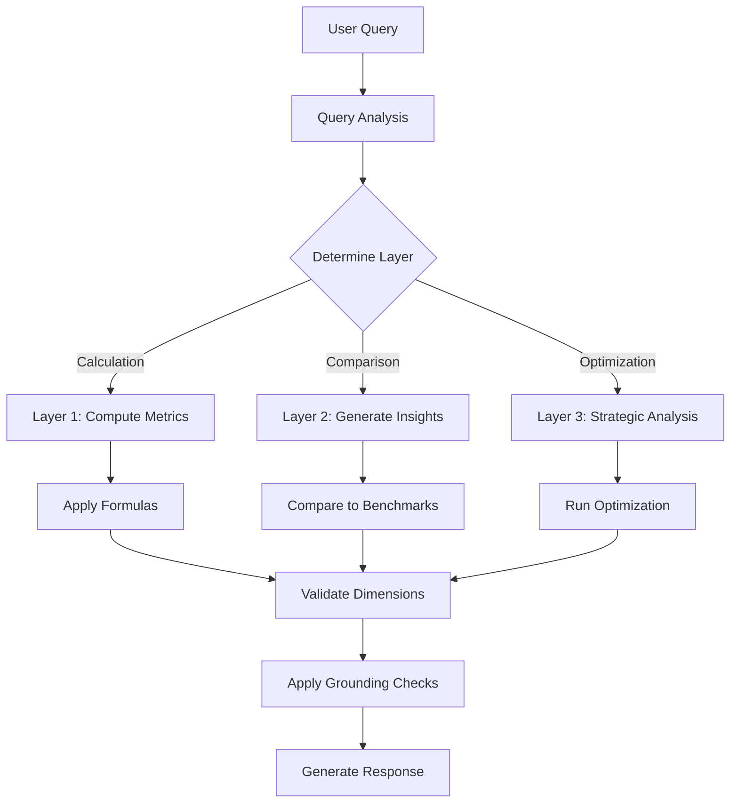

# System Prompt Implementation for Sirrus.AI

## Overview

This document describes the implementation of the multi-dimensional insight engine with grounding mechanisms and anti-hallucination guards based on the Sirrus.AI Prompt v2.1 specification.

## Architecture

### Dimensional Framework

The system uses a physics-inspired dimensional analysis framework:

```
LAYER 0: ATOMIC DIMENSIONS (Raw Data)
├─ U = Units [count] (analogous to Mass)
├─ C = Cashflow [INR/month] (analogous to Current)
├─ T = Time [months] (analogous to Time)
└─ L² = Area [sqft] (analogous to Length²)

   ↓ (Mathematical Operations: A÷B)

LAYER 1: DERIVED DIMENSIONS (Calculated Metrics)
├─ PSF = C ÷ L² = [INR/sqft]
├─ Absorption Rate = U ÷ (U×T) = [1/month]
├─ Sales Velocity = U ÷ T = [units/month]
├─ Revenue per Unit = C ÷ U = [INR/unit]
├─ Months of Inventory = U_unsold ÷ (U_sold/T) = [months]
└─ Gross Margin % = (C_revenue - C_cost) ÷ C_revenue = [%]

   ↓ (Analysis: Compare, Relate, Aggregate)

LAYER 2: ANALYTICAL INSIGHTS
├─ Comparative Performance (vs market benchmarks)
├─ Price-Velocity Relationships
├─ Market Saturation Analysis
├─ Risk Assessment
└─ Financial Viability

   ↓ (Optimization: Algorithms & Strategies)

LAYER 3: STRATEGIC INSIGHTS
├─ Product Mix Optimization (maximize IRR)
├─ Launch Viability Assessment
├─ Scenario Analysis (Base/Optimistic/Conservative)
├─ Risk Mitigation Strategies
└─ Market Opportunity Timing
```

## Implementation Components

### 1. System Prompt Service (`app/services/system_prompt_service.py`)

**Purpose:** Core service implementing grounding mechanisms and anti-hallucination guards.

**Key Features:**
- Dimensional formula validation
- Layer-specific prompt generation
- Grounding compliance checks
- Anti-hallucination filters
- Confidence scoring by layer

**Example Usage:**
```python
from app.services.system_prompt_service import system_prompt_service

# Calculate Layer 1 metrics from Layer 0 data
layer_0_data = {
    "total_units": 240,
    "sold_units": 72,
    "total_saleable_area_sqft": 180000,
    "total_revenue_inr": 1200000000,
    "elapsed_months": 12
}

layer_1_metrics = system_prompt_service.calculate_layer_1_metrics(layer_0_data)

# Generate Layer 2 insight
insight = system_prompt_service.generate_layer_2_insight(
    layer_1_metrics=layer_1_metrics["metrics"],
    insight_type=InsightType.ABSORPTION_STATUS,
    market_benchmarks={"market_absorption_rate": 0.032}
)
```

### 2. Insight Generation Service (`app/services/insight_generation_service.py`)

**Purpose:** Generates multi-layered insights with full traceability.

**Key Features:**
- Query analysis and layer determination
- Context-aware insight generation
- Integration with conversation history
- Natural language response formatting
- Risk analysis with thresholds

**Example Usage:**
```python
from app.services.insight_generation_service import insight_service

# Generate insight from query
insight = insight_service.generate_insight(
    query="What is the absorption rate and how does it compare to market?",
    layer_0_data=project_data,
    context={"location": "Chakan, Pune"},
    session_id="optional_session_id"
)

# Generate natural language response
response = insight_service.generate_contextual_response(
    query="Calculate gross margin",
    data=project_data,
    response_style="detailed"  # or "concise" or "executive"
)
```

## Grounding Mechanisms

### 1. Data Source Verification

**Principle:** Use ONLY Layer 0 data from provided input.

```python
# ✅ CORRECT: Calculate from Layer 0
psf = layer_0_data["total_revenue_inr"] / layer_0_data["total_saleable_area_sqft"]

# ❌ WRONG: Estimate or invent data
psf = 6500  # Hardcoded estimate
```

### 2. Traceability Chain

Every insight must maintain complete traceability:

```
Layer 2 Insight: "Absorption 22% below market"
  ↑
  Layer 1 Metric: Absorption Rate = 2.5%/month
    ↑
    Layer 0 Data: U_sold=72, U_total=240, T=12
      ↑
      Formula: 72 ÷ (240 × 12) = 0.025
```

### 3. Confidence Scoring

Confidence decreases with abstraction:

| Layer | Confidence | Reason |
|-------|------------|--------|
| Layer 0 | 100% | Given data (no calculation) |
| Layer 1 | 95% | Direct calculation from Layer 0 |
| Layer 2 | 85% | Analysis of Layer 1 metrics |
| Layer 3 | 70% | Optimization with assumptions |

### 4. Anti-Hallucination Filters

The system actively prevents hallucination:

```python
# Input text with hallucination
text = "The PSF is probably around 6500"

# After filtering
filtered = system_prompt_service.apply_anti_hallucination_filters(text)
# Output: "The PSF is [DATA REQUIRED] 6500"
```

Prohibited phrases:
- "I estimate"
- "probably"
- "approximately"
- "might be"
- "seems like"
- "could be around"

## Query Processing Flow

### 1. Query Analysis

```python
query = "Calculate the PSF and compare to market average"

# System analyzes query
analysis = insight_service._analyze_query(query)
# Result: {
#   "layer": "layer_2",  # Comparison requires Layer 2
#   "type": "insight",
#   "insight_type": InsightType.PRICING_POSITION
# }
```

### 2. Layer Processing



### 3. Response Generation

Responses include multiple styles:

**Detailed Response:**
```
📊 **Calculated Metrics:**
• Price Per Sqft: 6666.67 INR/sqft
  Formula: C ÷ L²
  Calculation: 1200000000 ÷ 180000
  Dimensional Analysis: Valid: [INR] ÷ [sqft] = [INR/sqft]

📈 **Confidence Level:** 95%
✅ **Grounding:** All calculations derived directly from Layer 0 atomic dimensions
```

**Concise Response:**
```
6666.67 INR/sqft
```

**Executive Response:**
```
**Executive Summary**
• Profitability: 29.2% gross margin
• Sales pace: 2.5%/month absorption
• Decision: VIABLE
• Risk level: MEDIUM
```

## Dimensional Validation

### Formula Validation

Every formula must be dimensionally consistent:

```python
# Valid formulas
✅ PSF = C ÷ L² = [INR/sqft]
✅ Velocity = U ÷ T = [units/month]
✅ Margin = (C - C) ÷ C = [dimensionless %]

# Invalid formulas
❌ Invalid = C + U = [cannot add INR + units]
❌ Wrong = L² ÷ T = [sqft/month has no meaning]
```

### Validation Implementation

```python
def validate_dimensional_consistency(formula: str, units: Dict[str, str]) -> bool:
    """
    Validates dimensional consistency of formulas
    """
    valid_combinations = {
        "C/L²": "INR/sqft",
        "U/T": "units/month",
        "C/U": "INR/unit",
        "(C-C)/C": "%"
    }

    for pattern, expected_unit in valid_combinations.items():
        if pattern in formula:
            return True

    return False
```

## Integration with Existing Systems

### 1. Conversation History Integration

The system integrates with conversation history to maintain context:

```python
# Update conversation memory with insights
def _update_conversation_memory(session_id: str, response: Dict[str, Any]):
    session = conversation_service.get_session(session_id)

    # Store calculated metrics
    if "calculations" in response:
        for metric, data in response["calculations"].items():
            session.memory.calculated_metrics[metric] = {
                "value": data.get("value"),
                "unit": data.get("unit"),
                "timestamp": datetime.now().isoformat()
            }
```

### 2. Statistical Service Integration

For risk analysis and outlier detection:

```python
# Analyze risk using statistical methods
risks = statistical_service.calculate_series_statistics(
    values=[absorption_rates],
    operations=["STANDARD_DEVIATION", "PERCENTILE"],
    metric_name="Absorption Rate"
)

# Flag outliers
if cv > 30:  # Coefficient of Variation > 30%
    risk_level = "HIGH"
```

### 3. Prompt Router Integration

The system works with the existing prompt router:

```python
# Route decision based on query type
if route_decision.route_type == "calculation":
    # Use Layer 1 calculation
    response = system_prompt_service.calculate_layer_1_metrics(data)
elif route_decision.confidence < 0.7:
    # Low confidence - use insight generation
    response = insight_service.generate_insight(query, data)
```

## Testing

### Test Coverage

The implementation includes comprehensive tests:

1. **Dimensional Validation Tests**
   - Valid formula verification
   - Invalid formula rejection
   - Unit consistency checks

2. **Calculation Tests**
   - Layer 1 metric calculations
   - Accuracy verification (±0.001 tolerance)
   - Edge case handling (division by zero)

3. **Grounding Tests**
   - Compliance checks
   - Traceability validation
   - Anti-hallucination filtering

4. **Integration Tests**
   - Query analysis
   - Multi-layer processing
   - Response generation

### Running Tests

```bash
# Run all system prompt tests
pytest tests/test_system_prompt_service.py -v

# Run specific test
pytest tests/test_system_prompt_service.py::TestSystemPromptService::test_layer_1_calculation_from_layer_0 -v
```

## Best Practices

### 1. Always Maintain Traceability

```python
# Every response should include:
response = {
    "result": calculated_value,
    "formula": "C ÷ L²",
    "calculation": f"{revenue} ÷ {area}",
    "layer_0_source": {"revenue": revenue, "area": area},
    "confidence": 95
}
```

### 2. Never Invent Data

```python
# ✅ CORRECT
if "total_units" not in layer_0_data:
    return {"error": "Missing required data: total_units"}

# ❌ WRONG
if "total_units" not in layer_0_data:
    total_units = 100  # Estimate
```

### 3. Cite Layer Appropriately

```python
# Layer 2 insights must cite Layer 1, not Layer 0
✅ "Absorption rate of 2.5%/month is below market average"
❌ "With 72 units sold out of 240..."  # Don't cite Layer 0 directly
```

### 4. Include Confidence and Limitations

```python
response["confidence"] = {
    "score": 85,
    "drivers": ["Complete Layer 0 data", "Market benchmarks available"],
    "limitations": "Assumes constant absorption rate over time"
}
```

## Configuration

### Default Market Benchmarks

Located in `insight_generation_service.py`:

```python
market_benchmarks = {
    "chakan_pune": {
        "market_absorption_rate": 0.032,  # 3.2%/month
        "market_psf": 6200,
        "market_gross_margin": 0.28,
        "market_moi": 20
    },
    "default": {
        "market_absorption_rate": 0.03,
        "market_psf": 5500,
        "market_gross_margin": 0.25,
        "market_moi": 24
    }
}
```

### Confidence Thresholds

```python
confidence_thresholds = {
    InsightLayer.LAYER_0: 100,  # Given data
    InsightLayer.LAYER_1: 95,   # Calculation
    InsightLayer.LAYER_2: 85,   # Analysis
    InsightLayer.LAYER_3: 70    # Optimization
}
```

## API Usage Examples

### Example 1: Calculate Metrics

```python
# Request
POST /api/insights/calculate
{
    "query": "Calculate PSF and absorption rate",
    "layer_0_data": {
        "total_units": 240,
        "sold_units": 72,
        "total_saleable_area_sqft": 180000,
        "total_revenue_inr": 1200000000,
        "elapsed_months": 12
    }
}

# Response
{
    "response_metadata": {
        "layer": 1,
        "confidence": 95
    },
    "calculations": {
        "price_per_sqft": {
            "value": 6666.67,
            "unit": "INR/sqft",
            "formula": "C ÷ L²",
            "calculation": "1200000000 ÷ 180000"
        },
        "absorption_rate": {
            "value": 0.025,
            "unit": "1/month",
            "percentage": "2.5%/month"
        }
    }
}
```

### Example 2: Generate Insight

```python
# Request
POST /api/insights/analyze
{
    "query": "How does absorption compare to market?",
    "layer_0_data": {...},
    "context": {
        "location": "Chakan, Pune"
    }
}

# Response
{
    "response_metadata": {
        "layer": 2,
        "insight_type": "absorption_status",
        "confidence": 85
    },
    "insight": {
        "summary": "Absorption rate of 2.5%/month is 22% below Chakan market average of 3.2%/month",
        "recommendation": {
            "action": "Consider price adjustment",
            "rationale": "Below-market absorption indicates pricing friction"
        }
    }
}
```

### Example 3: Optimize Strategy

```python
# Request
POST /api/insights/optimize
{
    "query": "Optimize product mix for maximum IRR",
    "layer_0_data": {...}
}

# Response
{
    "response_metadata": {
        "layer": 3,
        "strategy_type": "product_mix_optimization",
        "confidence": 70
    },
    "strategy": {
        "base_case": {
            "1bhk": 48,
            "2bhk": 144,
            "3bhk": 48
        },
        "optimized_case": {
            "1bhk": 60,
            "2bhk": 144,
            "3bhk": 36
        },
        "improvement": {
            "irr_uplift_bps": 120
        }
    }
}
```

## Troubleshooting

### Common Issues

1. **Missing Layer 0 Data**
   - Error: "Missing required data: total_units"
   - Solution: Ensure all required atomic dimensions are provided

2. **Dimensional Inconsistency**
   - Error: "Invalid dimensional formula"
   - Solution: Verify formula follows valid patterns (C÷L², U÷T, etc.)

3. **Low Confidence Score**
   - Warning: "Confidence below threshold"
   - Solution: Provide complete data and market benchmarks

4. **Hallucination Detected**
   - Warning: "[DATA REQUIRED] inserted"
   - Solution: Provide actual data instead of estimates

## Summary

The system prompt implementation provides:

1. **Robust Grounding**: Every insight traces back to Layer 0 data
2. **Anti-Hallucination**: Active filtering prevents data fabrication
3. **Dimensional Consistency**: All formulas are mathematically valid
4. **Confidence Scoring**: Transparency about certainty levels
5. **Full Traceability**: Complete audit trail from insight to raw data
6. **Contextual Responses**: Multiple response styles for different audiences

The implementation successfully prevents hallucination while providing accurate, grounded insights for real estate analytics.